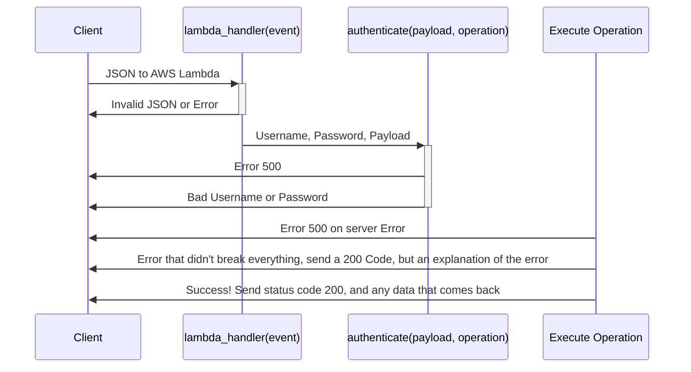

# Sequence Diagrams

## JSON Sequence Diagrams



##  Acceptable JSON Payloads

### Create A Flashcard JSON Payload
````JSON

{
    "operation": "create_flashcard",
    "payload":
        {"username": "patrick",
         "password": "pass_test",
         "object": <-a dictionary describing a flashcard object->
         }
}

````

### What a card object looks like

```
{
   
}
```
