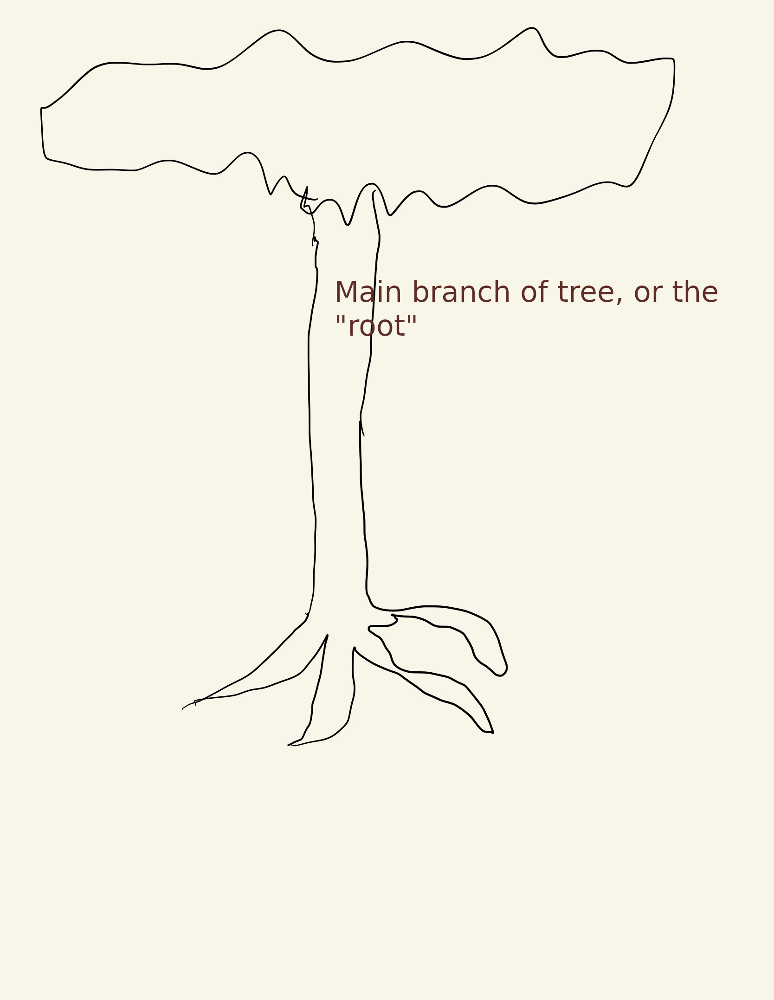
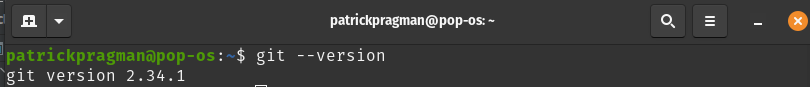
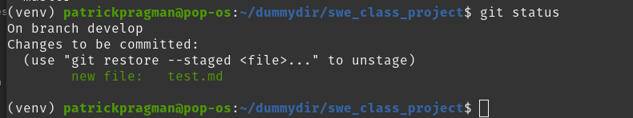
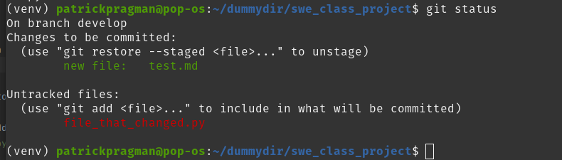

# Pat's Guide to Git and Github
## Pat Pragman
Contact me at one of the following with any questions:
* pat@pragman.io
* papragman@alaska.edu
* 907-782-5400

# Introduction

Building software is really hard; managing a project constructed by a team through completion is nothing short of
heroism. I'm pretty sure that everyone is really bad at it.  If it's not "everyone" then it's definitely the case that I
am awful at it.

At the very least, I'm inexperienced and that lends itself to a sort of "over-estimation" of my own skills and
capabilities.  It's much better for all of us involved if I just simply accept that I am incompetent and try to build
tools to limit the damage that I can do at any one time.

But, so what if I'm incompetent?  Everyone's got to start somewhere, so why does it matter if I periodically write bad 
code?

# I can single-handedly break everything...

Suppose we have a bunch of code running some place.  If I make a change that nobody else has reviewed or nobody else has
at least looked at, what happens if my code is a breaking change?  What happens if I break everything?  Worse, what goes
down if I break everything then get hit by a bus the following morning?

The rest of the people on the team may not be able to fix it.  My individual incompetence could bring down the entire
operation!

I'm a mad man and I must be stopped!  Or at least "not allowed to break things that other people may need."

# Well, that was hyperbolic - but sure.  Ok, how?

Well, in the old days, you'd have some sort of approval process, or people would email code back and forth, or store
code on a centralized server that was the "source of truth" and you'd have some process that would prevent "bad code"
from getting to production environments.

Maybe your company had a guy - let's say his name is "Todd."  Todd's only job was to review code and sign off on it.  That's 
not very efficient.  Also, Todd probably hates his life - reading code all day and never doing anything creative at all.
That sounds terrible - worse yet, maybe Todd was testing the code for bugs too.  What if he missed something?  Also, how
long will it take Todd to read the code from 100 developers?  A long time right?  That's too slow and makes a bottle-neck
in our entire process.  If we can't ship until Todd reads it and approves it then we won't be able to iterate very quickly.

It's certainly not "agile."

No, we don't need or want a Todd.  We want a developer to be able to focus on doing what developers do - namely that is,
writing code.  Also, we need more than one perspective on our code - we should _all_ be reading eachother's code periodically.  If
Alice writes code, Bob should be able to find it, read it and know that Bob is getting Alice's latest version too!  It doesn't help
anyone if the code is being shared by email or stored on each person's computer...

Plus we live in 2022.  My job is much cooler if there's a robot somehow involved in the work.  I want a 
robot dammit!

# ~~Automation~~ Bad Ass Robots

So, I don't want Todd.  I want a robot.  Namely, I want a robot that does a few things for me to make sure I don't break
everything, and I need to be able to share all the work I'm doing with everyone easily.  Basically, I'm lazy.  So what
does my robot need to be able to do?

1. The robot should check my work and make sure I'm not going to break everything.
2. The robot should let me know if I write code that breaks everything.
3. The robot should let me know if I write sloppy code

Furthermore, to protect myself from... well... myself... we should have some stuff set up to prevent me from by-passing
the robot or otherwise just mashing buttons until the code is running in production.
4. The robot should block my attempts to get around it.

Finally, because robots can be stupid, only after all the robot's work is done we should put a couple humans in the loop to give
the final approval then

5. The robot should deploy the code so that the end result is the same.

The last step, prevents the "well it worked on my computer" sort of issues that you get when you have inconsistent development
environments between team members.

So basically, the "work flow" will go like this:

1. Write some code.
2. Give that code to the robot who checks it out.
3. If the robot says it's fine, review the code with a person, otherwise fix your code (go back to one)
4. If the human says it's fine, the robot takes and deploys the code.

Note that we only have a fellow human do two things.  The humans write the code and work together to serve as the final
check to make sure that we're not making a silly mistake.  For example, you could delete a file by accident and the robot
doesn't bother to test that file, but it turns out that file contained the implementation of an important feature and
by deleting it, you deleted that feature.

The humans would notice that, the robot wouldn't.  We need to be able to track the changes and sanity check them as we
go.  Further, the human could tell you if your code was an unreadable mess - your code may run, but it may be impossible
to understand - that's "sub optimal" too - we write code for other humans to read as well as for machines to execute.

# Change tracking, then?

So as part of this whole toolset (the current nomenclature for it is "pipeline") we need to be able to see what's changed and
keep changes that break the whole thing from getting to something that customers / users can see.

That is where git comes in.

# WTF is Git

Git is a tool that runs in the command line that allows us to see the changes that have been made to a project, and approve
the merging of changes back into the final project.

Take a look at this ridiculous poorly drawn tree and pretend it's our project.


Think of that tree as our project - I know, I'm a terrible artist.  The main "root" or the middle part of the tree is the "master" branch
of the tree.  That is the part of the tree that customers interact with.



If you make a change to the "master branch" that's too aggressive you might break the tree!  So instead you make a "branch"
off of the tree where you can try out your feature:


if that works you "pull" the "branch" back into the main "branch" of the tree.  I get that it's a silly metaphor, but that's all
that git is doing.

This is cool for two reasons, it allows us to work on the project at different times and different speeds.

So, we can "branch off" and explore features and pull the branches back into the "main" or "master" branch of the tree
when we've decided that it's good enough.  It's a little more complicated than that - and I'm certainly "not an expert" 
but it's a critical tool for making sure we can rewind our work and "undo" breaking changes.

This [video](https://www.youtube.com/watch?v=hwP7WQkmECE) is great showing how it works, and it is short.

Note that the video says "merge" and not "pull" - well, we're working with remote repositories - that is git repos that 
are stored "in the cloud" (read: "on other people's computers").  A pull is just a merge that happens over
the internet.  ([see this stack exchange thread](https://stackoverflow.com/questions/57705034/git-merge-difference-between-pull-and-merge))

That's where Github comes in.

# Ok, then WTF is Github?

Github is just a tool for managing repositories over the internet.  That's it.  It lets you keep track of changes when
people are working on projects on different computers and allows you to have some automation tooling to make it easier to keep
from breaking things.

It's a tool for storing your code online as well as giving your robot a place to live.

# How the hell do I actually get access to the code then?

First, you need to make sure you have git.  You should have git, but let's check.  Got to the command line
and enter the following:

```git --version```
you should see something like this:


If that returns an error, or something weird happens, make sure you have git installed on your computer.  Follow the
instructions here:

[Git's Installation Instructions](https://git-scm.com/book/en/v2/Getting-Started-Installing-Git)

Next, we need to "clone" the git repo where our code lives:

Go to the command line and clone the project:

```
git clone https://github.com/patpragman/swe_class_project
```

this should make a directory called "swe_class_project" that contains all of the project files.

Now we need to make a virtual environment so that our deployment is the same on every computer.  Run the following commands:

```
cd swe_class_project  # change into project folder
mkdir venv  # make a folder to hold the virtual environment
cd venv  # change to it
python3 -m venv .  # get all the stuff for the venv
cd .. # go back up a level
source venv/bin/activate # activate your virtual environment
pip install -r requirements.txt  # install all the project requirements
```

prior to running any code, you must make sure your venv is active... ask me if you don't know what it means.

now if you decided you want to make a change, make sure (always!) that you're not on the master branch.

type
```git branch```
to see the branches available to you, if you want to make changes type:

```
git branch develop
git checkout develop
```

now any changes that you make will be separated from the master branch!  Cool!

the entire script to set up the development environment is this:

```
git clone https://github.com/patpragman/swe_class_project
cd swe_class_project  # change into project folder
mkdir venv  # make a folder to hold the virtual environment
cd venv  # change to it
python3 -m venv .  # get all the stuff for the venv
cd .. # go back up a level
source venv/bin/activate # activate your virtual environment
pip install -r requirements.txt  # install all the project requirements
git branch develop
git checkout develop
git push --set-upstream origin develop  # this may not work unless you've already got a gh account set up
```

# Basic Git Commands

First off, to make things easy, we're always going to do work on the "develop" branch on our repositories.

To find out what branch you're on, type:

```git branch```

this will list all the branches that are available to you.


The start indicates the branch that you're on.  If you want to see the status of that branch, type

```git status```



you'll see a quick status - in the example, you can see there's a file "test.md" that's ready to be committed.


So suppose you make a change to the code on the develop branch.  How do I save that change?  You add that to the current
commit that you're working on.  To see the changes type ```git status again```:


See there's a new file?

Stage the files you wish to add to this particular commit with the following command:
```git add file_that_changed.py```

Then commit changes with

```git commit -m "edited file_that_changed.py to include a call to the bogus library."```

That's it!  You've saved your work locally!

# Ok... so how do I get code from my computer to github?

Make sure that you have a github account and that it's all set up.

Now how do I get my code to the repo?  Simple!

```git push```

This triggers the creation of a "pull request" on the github page.  At that point, we do the last human check
and the code gets merged!

# Recap

So, how does this work?

1. You write code
2. You add that code to the current commit
3. You commit the code
4. You push the code to the development branch
5. The robots check to make sure we didn't break anything.
6. We get a pull request that humans approve
7. We merge the pull request back into master.
8. The robot deploys the changes.

That's it.  You write code, and the robot does the heavy lifting!