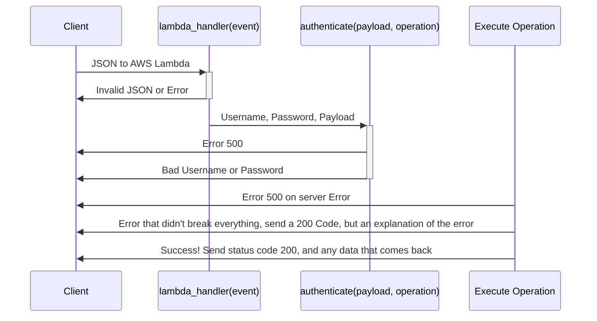
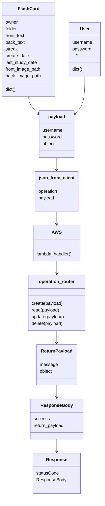

# Sequence Diagrams

## JSON Sequence Diagrams



##  Acceptable JSON Payloads

### Why

This document lays out what the JSON to and from the server should look like

### Create A Flashcard JSON Payload
````JSON

{
    "operation": "create_flashcard",
    "payload":
        {"username": "patrick",
         "password": "pass_test",
         "object": <-a dictionary describing a flashcard object->
         }
}

````
### Flow of JSON as class diagram



### How does this translate to JSON

#### Example JSON of a "object" in a JSON payload

##### Flashcard
```json
{
    "owner": "patrick", 
    "folder": "test / not import", 
    "front_text": "test_card_front", 
    "back_text": "test_card_back", 
    "streak": "0", 
    "create_date": "2022-10-16 17:03:15.074063", 
    "last_study_date": "2022-10-17 17:03:15.074074", 
    "next_study_due": "2022-10-21 17:03:15.074075", 
    "front_image_path": "None", 
    "back_image_path": "None"
}
```

##### User
Presumably we'd want to encrypt on the front end before we even sent this object
to the backend, but here's what one would look like
```json
{"username": "patrick", 
  "password": "pass_test"}
```

##### return_payload for a create flashcard
```json
{"message":"user saved!"}
```
##### return_payload for a create user
```json
{"message":"flashcard saved!"}
```

### Retrieve Operations

what you get when fetching all user cards
```json
{
  "message": "fetched the following cards for <username>",
  "objects": [list of cards]
}
```

