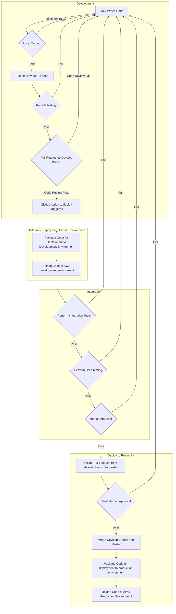

```mermaid
    graph TB;
        
        subgraph Development
            A[Dev Writes Code]
            B{Local Testing}
            C[Push to 'develop' Branch]
            C_2{Pull Request to Develop Branch}
            D{Remote testing}
            E[GitHub Action to deploy Triggered]
            
            A -- git commit --> B
            B -- Fail --> A
            B -- Pass --> C

            C --> D
            D -- Fail --> A
            D -- Pass --> C_2
            C_2 -- Code Review Pass --> E
            C_2 -- Code Review Fail --> A
        end
    
        subgraph Automatic Deployment to Dev Environment
            E --> F[Package Code for Deployment to Development Environment]
            F --> G[Upload Code to AWS development environment]
        end
        
        subgraph Integration
            H{Perform Integration Tests}
            I{Perform User Testing}
            J{Human Approval}
            
            H -- Pass --> I
            H -- Fail --> A
            
            I -- Pass --> J
            I -- Fail --> A
        end
        
        G --> H
        J -- Pass --> K
        J -- Fail --> A
        subgraph Deploy to Production
            K[Initiate Pull Request from develop branch to master]
            L{Final Human Approval}
            M[Merge Develop Branch Into Master]
            O[Package Code for deployment to production environment]
            P[Upload Code to AWS Production Environment]
            
            L -- Pass --> M
            K --> L
            
            M --> O
            O --> P
            
            
        end
        
        L -- Fail --> A
        

```