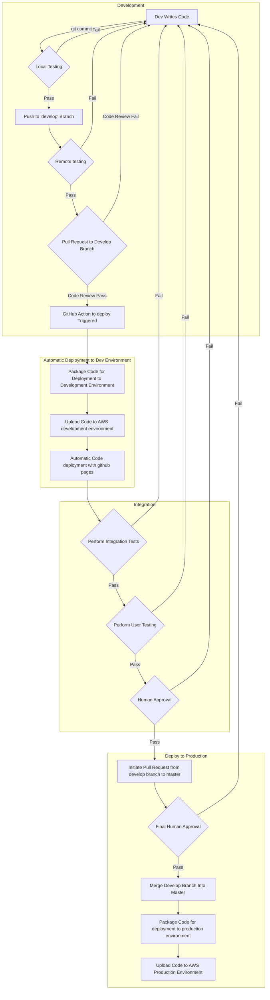
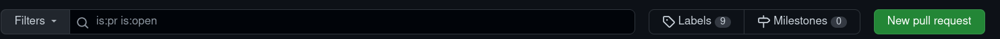
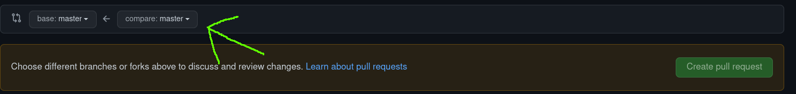
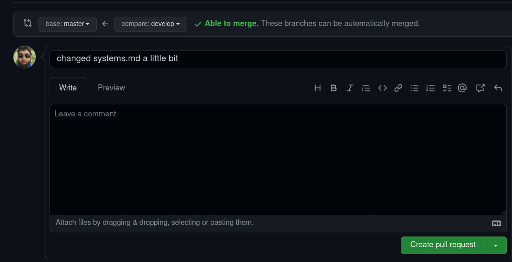
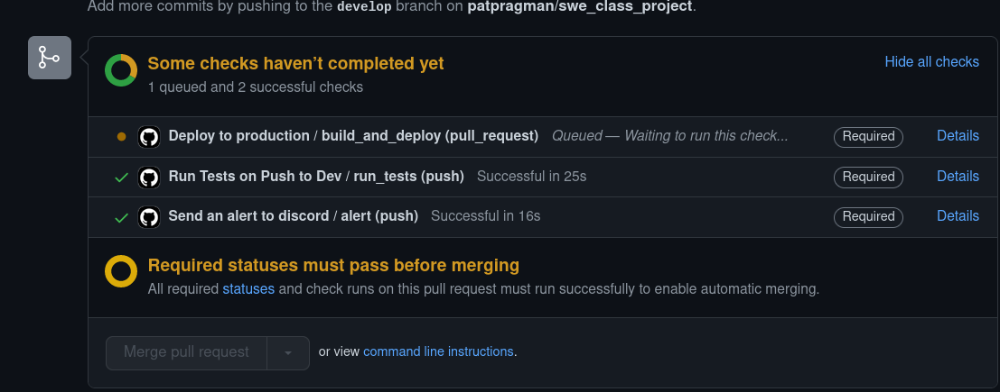
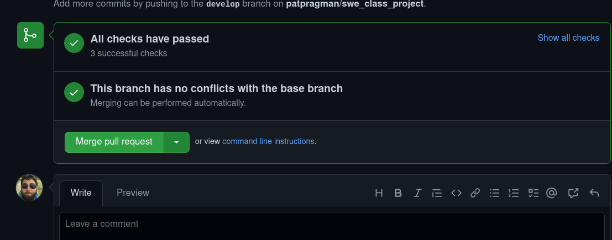

Basic Layout of Deployment Pipeline:

# How to approve a Pull Request
Navigate to the "Pull Request" tab in github

change this drop down to the branch you want to pull into master, then click "create pull request"

write about how you're changing things:

let all the tests run

confirm the PR

# Basic Layout of Architecture (WIP):
