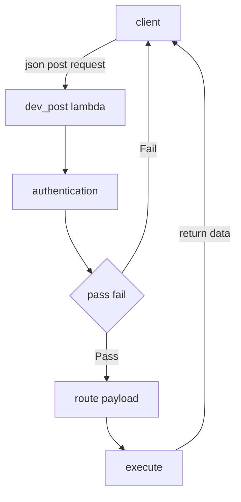

#  Lambda Documentation
## Patrick Pragman

### How does this work?

The general workflow is like this:

1. A post request gets made to the AWS lambda function - which is open and accessible
to anyone
2. the post request contains a json packet that contains instructions
for the lambda function which tells the lambda function what code to run
3. the lambda function calls the "authenticate" function on the payload
4. if it authenticates, the payload is then routed to the appropriate function
5. the function runs, and returns a json object containing information
and/or a status message

For example, consider the diagram of the operation of the create_flashcard function.
